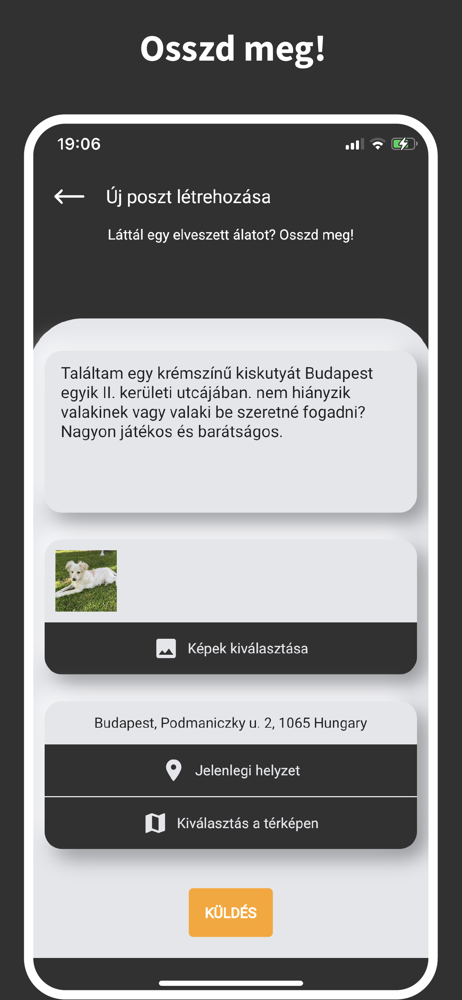
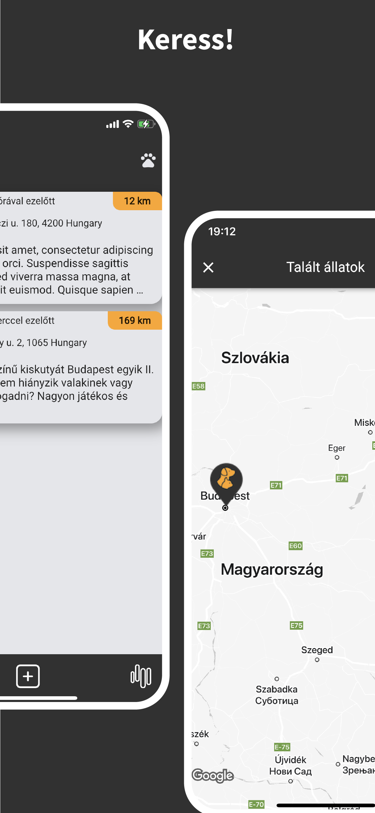
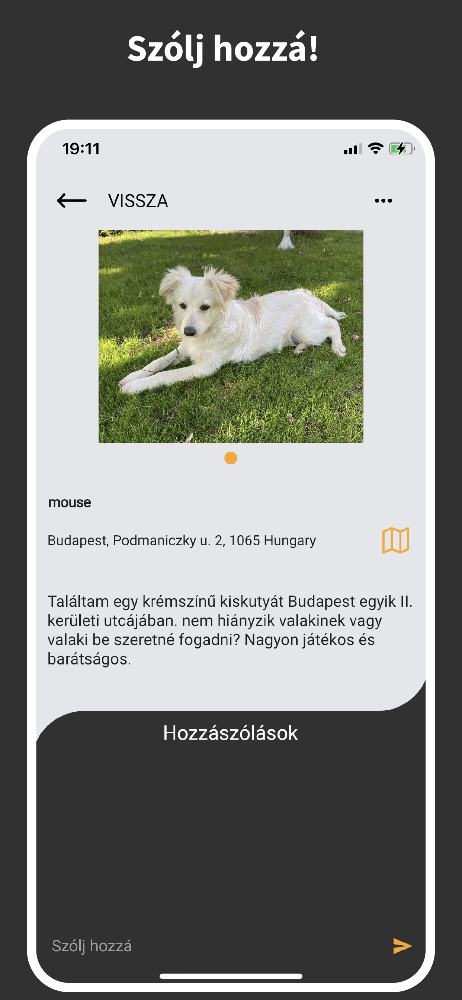
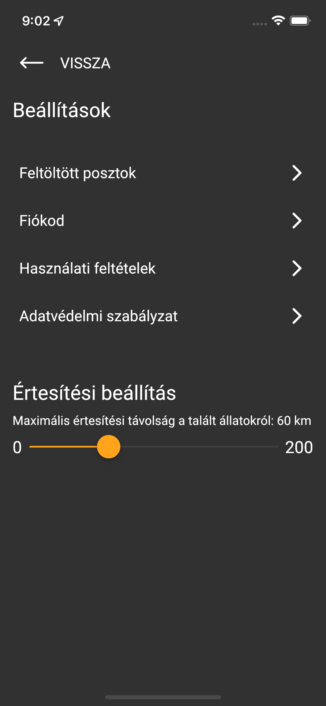

# Woofinder app

This is a lost pet finder app. 
It was written in 2022 and was my first app to be published on the Google Play Store and Apple App Store.

## Getting Started
sdks:
  dart: ">=2.15.0 < 3.0.0"
  flutter: ">=2.5.0"

I tried with:
- Flutter 2.10.5
- Dart 2.16.2

```
flutter clean
flutter pub get
flutter gen-l10n
```

<div style="display: flex; flex-wrap: wrap;">
  
  
  
  
</div>
